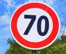

#**Traffic Sign Recognition** 

### Writeup / README

#### 1. Provide a Writeup / README that includes all the rubric points and how you addressed each one. You can submit your writeup as markdown or pdf. You can use this template as a guide for writing the report. The submission includes the project code.

Here is the link to my [project code](https://github.com/rnaidu02/CarND-Traffic-Sign-Classifier-Project/blob/master/Traffic_Sign_Classifier.ipynb)

### Data Set Summary & Exploration

#### 1. Provide a basic summary of the data set. In the code, the analysis should be done using python, numpy and/or pandas methods rather than hardcoding results manually.

I used the pandas library to calculate summary statistics of the traffic
signs data set:

* The size of training set is 154219
* The size of the validation set is 4410
* The size of test set is 12630
* The shape of a traffic sign image is (32, 32, 3)
* The number of unique classes/labels in the data set is 43

#### 2. Include an exploratory visualization of the dataset.

Here is an exploratory visualization of the data set. It is a bar chart showing how the data of the classes/unique signs are spread within the training set. As you can see the number of samples in each type of traffic sign is not uniform.The range of the spread is between 180 to 2010. About half of the classes have less than 500 samples. This is an issue that need to be addressed by adding more samples to the classes that are less in number.

### Design and Test a Model Architecture

#### 1. Describe how you preprocessed the image data. What techniques were chosen and why did you choose these techniques? Consider including images showing the output of each preprocessing technique. Pre-processing refers to techniques such as converting to grayscale, normalization, etc. (OPTIONAL: As described in the "Stand Out Suggestions" part of the rubric, if you generated additional data for training, describe why you decided to generate additional data, how you generated the data, and provide example images of the additional data. Then describe the characteristics of the augmented training set like number of images in the set, number of images for each class, etc.)

As a first step, I decided to add more data to the the data set to make the classes with fewer samples to have more so that they will have more representation in the training set and also to have more samples for all the classes with different distortions and enhancements. If the class has less than 500 samples in the training set, then I've generated image augmentation (7 effects) to all of the samples. This means if the class has fewwer than 500 samples in the initial training set, then it's count will increase by 7x of its initial count. If the class has more than 500 then I've applied only 500 randomly selected images for image augmentation. This approach gives me more samples and at the same time reduce the inequality of distribution between classes with more and fewer samples.

After image augmentation, the range of samples within each class became 1440 to 5510. The class with least count increased its samples count by 8x, and the samples for class with most samples increased by ~2x.

I used the following techniques

- Random noise: Used Gaussian noise to introduce some noise to the training images as additional data point. Here I've used skimage.util.random_noise() function to introduce random noise.
- Sharpen Image: Sharpen the image by taking deducting the Gaussian blur kernel (3x3) from the image.
- Rotate image by 10 degrees clock wise: Rotate the image to simulate the condition where the traffic sign was captured with a slight angle.
- Rotate image by 10 degrees counter clock wise: Rotate the image to simulate the condition where the traffic sign was captured with a slight angle.
- Shift the image towards bottom-right: Shift the image to simlate the condition that the captured traffic sign was at one of the corner.
- Shift the image towards top-left: Shift the image to simlate the condition that the captured traffic sign was at one of the corner.
- Enhance the image: I've seen many of the training images are  very dark and hardly can see the traffic signs. I've used Equlize histograms to enhance the image.

Here is an example of an original image and augmented images as described above:

The difference between the original data set and the augmented data set is the following:
- The number of training images went up from ~35k to ~150k.
- The number of images in classes that are significantly small are increased by ~8x in augmented data set.
- Various distortions and enhancements (as described above) to the images were introduced in the augmented data set. 

As a last step, I normalized the image data because
      I want the values to be in a small range so that the relu layer wouldn't keep the at 1 most of the time (as the range of pixel values are 0 - 255). For this reason, I normalized the pixel values within the range of 0 - 1 by dividing the pixel values by 255. I kept the three color channel intact so as to preserve the color and I beleive the color could playa role in the identification of a traffic sign.

#### 2. Describe what your final model architecture looks like including model type, layers, layer sizes, connectivity, etc.) Consider including a diagram and/or table describing the final model.

My final model consisted of the following layers:

| Layer         		|     Description	        					| 
|:---------------------:|:---------------------------------------------:| 
| Input         		| 32x32x3 RGB image   							| 
| Convolution 5x5     	| 1x1 stride, VALID padding, outputs 28x28x3 	|
| RELU					|												|
| Max pooling	      	| 2x2 stride,  outputs 14x14x3 				|
| Convolution 5x5     	| 1x1 stride, VALID padding, outputs 10x10x32 	|
| RELU					|												|
| Max pooling	      	| 2x2 stride,  outputs 5x5x32 				|
| Convolution 3x3     	| 1x1 stride, VALID padding, outputs 3x3x256 	|
| RELU					|												|
| Max pooling	      	| 1x1 stride,  outputs 2x2x256 				|
| Fully connected	|   outputs 1x1024					|
RELU					|												|
| Fully connected	|   outputs 1x512					|
RELU					|												|
Dropout					| dropout= 0.5												|
| Softmax				| outputs 1x43        												|
 

#### 3. Describe how you trained your model. The discussion can include the type of optimizer, the batch size, number of epochs and any hyperparameters such as learning rate.

To train the model, I used a modified version of LeNet (By having more kenels (depth) of sizes 5x5 and 3x3. I've added 3 conv layers, 2 Fully connected layers and the dropout layer at the end - before logits layer.

The batch size I used was 128. I've a nVidia GPU on my system and was able to train with batch 128 very well.
Number of epochs chosen are 100. Though it is reaching 93% validation accuracy within 50 epochs, I tried 100 epochs to see how much higher the training and validation accuracy go.
Learning rate I chose was 0.0005. I've played with learning rate of 0.0001 to 0.01. This learning rate gives me the best performance in terms of validation accuracy. The higher the learning rate, the validation accuracy floats around after a certain point and doesn't increase as with the learning rate of 0.0005.

#### 4. Describe the approach taken for finding a solution and getting the validation set accuracy to be at least 0.93. Include in the discussion the results on the training, validation and test sets and where in the code these were calculated. Your approach may have been an iterative process, in which case, outline the steps you took to get to the final solution and why you chose those steps. Perhaps your solution involved an already well known implementation or architecture. In this case, discuss why you think the architecture is suitable for the current problem.

My final model results were:
* training set accuracy of 0.997
* validation set accuracy of 0.962 
* test set accuracy of 0.939

Initially I've tried with LeNet (with 2 conv, 2 FC layers) and the original training set provided. With this combination I was getting about 81% accuracy at its best with a combination of batch size and learning rate. After trying out different learning rates (within the ranges of 0.0001 to 0.01), I 've decided to stick with 0.005 which gave me the desired validation accuracy within reasonable amount of ecpochs and training time. Also I've experimented with batch sizes. Batch size also seems to have impact with the validation accuracy. With smaller batch sizes it is not converging that fast and the validation accuracy is not even reaching 81%.

For first thing I tried is to change/improve the existing LeNet architecture by adding more depth to the kernels and also add more layers so that additional features can be extracted. The reason why I took this approach is that LeNet worked best on mnist dataset (which is grayscale images). Since the traffic sign dataset is in color and by having more conv kernels with more conv layers will help in extracting the features. Here I tried different depths for the conv kernels. These changes improved the validation accuracy to around 90% and not beyond. The code for this network architecture is in cell# 10 of my ![notebook] (https://github.com/rnaidu02/CarND-Traffic-Sign-Classifier-Project/blob/master/Traffic_Sign_Classifier.ipynb). To not to overfit with the training set, I 've added a dropout layer with 0.5 probability at the 2nd fully connected layer weights.

At this time I though I should focus on the training content to improve the validation accuracy. As a first attempt I would like to use existing frameworks to have image augmentation and I found Keras as one source to begin with. After spending good amount of time on adding ZCA filter, random shifts, Feature standradization techniques on the existing training set, the training set became around 100k, but the accuracy didn't jump reach consistent 93% everytime. It is also taking very long time for the image augmentation using jeras (much longer than 100 epochs of training). When looking to visualize the output images after the augmentation techniques, the output for ZCA filter is mot looking good as well. For the above reasons, I looked for alternatives and found open cv has some api that can be used for image augmentation. I have appllied 7 different disctoprtions/enhancements to the existing training set and was able to get about 150k images (details on the spread is described in section 1 of the writeup).

After the image augmentated training set with 150k samples, with the enhanced LeNet arhitecture, the results are promising. I was able to get around 96% for validation accuracy and 99.7% for training accuracy within 50 epochs.

With the network (modified LeNet) I chose, I was able to get a validation accuracy of 96%, and testing accuracy of 94%. From this data, I beleive that the model is not overfitting with the training set and is doing a reasonable job.

To get around 
If an iterative approach was chosen:
* What was the first architecture that was tried and why was it chosen?
* What were some problems with the initial architecture?
* How was the architecture adjusted and why was it adjusted? Typical adjustments could include choosing a different model architecture, adding or taking away layers (pooling, dropout, convolution, etc), using an activation function or changing the activation function. One common justification for adjusting an architecture would be due to overfitting or underfitting. A high accuracy on the training set but low accuracy on the validation set indicates over fitting; a low accuracy on both sets indicates under fitting.
* Which parameters were tuned? How were they adjusted and why?
* What are some of the important design choices and why were they chosen? For example, why might a convolution layer work well with this problem? How might a dropout layer help with creating a successful model?

If a well known architecture was chosen:
* What architecture was chosen?
* Why did you believe it would be relevant to the traffic sign application?
* How does the final model's accuracy on the training, validation and test set provide evidence that the model is working well?
 

### Test a Model on New Images

#### 1. Choose five German traffic signs found on the web and provide them in the report. For each image, discuss what quality or qualities might be difficult to classify.

Here are ten German traffic signs that I found on the web:

    
    

The Ninth image (Go straight/right) might be difficult to classify because it can be often be confused with the Turn right (First image). With 28x28 source image and the poor quality of initial training set images, it is quite possible that this can heppen.

Also I feel that the speed 60/70 signs also can be mis classified due to closeness in its shape and digits.

#### 2. Discuss the model's predictions on these new traffic signs and compare the results to predicting on the test set. At a minimum, discuss what the predictions were, the accuracy on these new predictions, and compare the accuracy to the accuracy on the test set (OPTIONAL: Discuss the results in more detail as described in the "Stand Out Suggestions" part of the rubric).

Here are the results of the prediction:

| Image			        |     Prediction	        					| 
|:---------------------:|:---------------------------------------------:| 
| Turn right      		| Turn right 		| 
| General Caution     		| General Caution |
| Speed Limit 60     		| Speed Limit 60 |
| Children crossing     	| Children crossing |
| Road work     		| Road work  |
| Yield				| Dangerous curve to the left| 
| Priority road			|  Priority road |
| Speed Limit 70	      	| Keep right	|
| Go straight or right		| Go straight or right  | 
| Stop				| Stop  |   							

The model was able to correctly guess 8 of the 10 traffic signs, which gives an accuracy of 80%. This compares favorably to the accuracy on the test set of 12630. Since the sample of 10 is very less and may not provide the accurate estimate of the model. Also the images from web are with different sizes and resizing them to small size of 32x32 will also may loose some of the details.

Predictions of the 10 test images from the Web:

#### 3. Describe how certain the model is when predicting on each of the five new images by looking at the softmax probabilities for each prediction. Provide the top 5 softmax probabilities for each image along with the sign type of each probability. (OPTIONAL: as described in the "Stand Out Suggestions" part of the rubric, visualizations can also be provided such as bar charts)

The code for making predictions on my final model is located in the 18, 19, and 20 th cell of the Ipython notebook (https://github.com/rnaidu02/CarND-Traffic-Sign-Classifier-Project/blob/master/Traffic_Sign_Classifier.ipynb).

For the first image, the model is relatively sure that this is a stop sign (probability of 0.6), and the image does contain a stop sign. The top five soft max probabilities were

| Probability         	|     Prediction	        					| 
|:---------------------:|:---------------------------------------------:| 
| 1.0         			| Turn right ahead   									| 
| 0.0     				| Round about manadatory 										|
| 0.0					| Speed limit (20 km/h)											|
| 0.0	      			| Speed limit (30 km/h)					 				|
| 0.0				    | Speed limit (50 km/h)      							|

I will also detail the predictions for an image that is mis classified. For the eight image which is supposed to be 'Speed limit (70km/h)' - that is classified as Tield sign. Here the right classification has only 0.05 probability in the prediction.

| Probability         	|     Prediction	        					| 
|:---------------------:|:---------------------------------------------:| 
| 0.95         			| Yield   									| 
| 0.05     				| Speed limit (70 km/h) 										|
| 0.0					| Keep right)											|
| 0.0	      			| Go straight					 				|
| 0.0				    | Speed limit (20 km/h)      							| 

Here is an image that shows the probabilites of predictions for all of the 10 images that were tested

### (Optional) Visualizing the Neural Network (See Step 4 of the Ipython notebook for more details)
####1. Discuss the visual output of your trained network's feature maps. What characteristics did the neural network use to make classifications?

